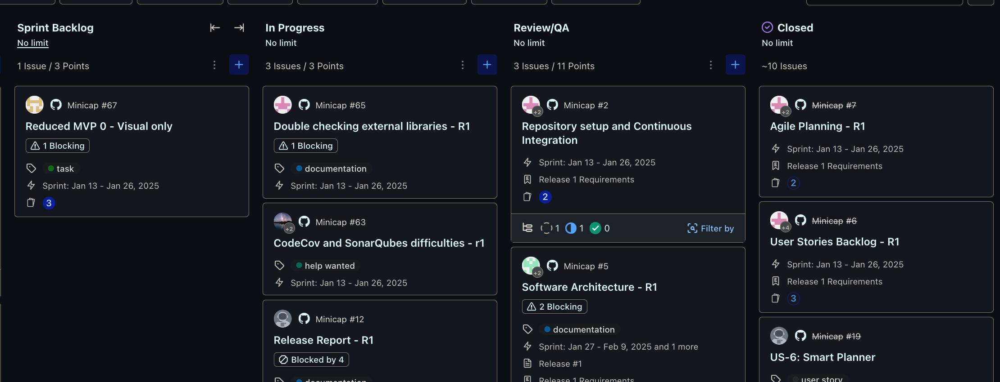

# Team Work Procedures (Refined - 2025-01-26)

## Introduction

For efficient application development with an 11-person team, we use overlapping roles across **Design** and **Development** phases within a 28-day release cycle (2 x 2-week sprints).

*   **Sprint 1 (Weeks 1-2):** Focus on Design (first 3 days) and feature development (Feature 1).
*   **Sprint 2 (Weeks 3-4):** Feature development (Feature 2), bug fixes, reporting.
*   **Goal:** Deliver one feature *coded* per 2-week sprint, with a full release report and testing suite per 28-day release cycle.  Features may not be fully tested by sprint end, but all feature-related tasks must be coded.
*   **Design Pattern:** MVVM.
*   **Documentation:** All documentation will be pushed to GitHub. QA procedures are documented separately: [QA Documentation Link Here]

## 28-Day Release Cycle Timeline

*   **Days 1-3: Design Phase (Sprint 1 - Week 1)**
    *   Diagrams (System Context, Component, ERD)
    *   Operation Contracts
    *   Wireframes
    *   Sprint Plan & Backlog Refinement
*   **Days 4-14: Code Phase - Sprint 1 (Weeks 1-2)**
    *   Sprint Backlog Task Execution - Feature 1 Development (Coding)
    *   Code Development & Unit Testing (ongoing)
    *   Pull Requests & Code Reviews (ongoing)
    *   **Day 14 (End of Sprint 1): Feature 1 Code Complete.** All tasks related to Feature 1 coding must be finished.
*   **Days 15-27: Code Phase - Sprint 2 (Weeks 3-4)**
    *   Sprint Backlog Task Execution - Feature 2 Development (Coding)
    *   Code Development & Unit Testing (ongoing)
    *   Pull Requests & Code Reviews (ongoing)
    *   **Day 28 (End of Sprint 2 / Release Day): Feature 2 Code Complete.** All tasks related to Feature 2 coding must be finished.
*   **Days 25-27: Report Phase (End of Sprint 2 - Week 4) - *Scrum Masters and QA Only***
    *   Scrum Master Reports & Retrospectives
    *   Release Documentation Finalization
    *   **Important:** The Report Phase is *exclusively* for Scrum Masters and QA. All other team members (Frontend Developers, Backend Developers, Team Leads, System Designers, UI/UX Designers) continue coding on new tasks during this phase.

## Team Roles

Roles are assigned per release. Discuss role changes with Scrum Masters.

*   **Scrum Master (3):** Sprint planning, project management, meeting documentation, user stories/tasks, sprint execution, *Report Phase activities*.
*   **Team Lead (4):** Subteam communication (to/from Scrum Masters), team progress updates, *continues coding during Report Phase*.
*   **System Designer (3):** System diagrams, operation contracts, ERDs (completed before coding), *continues coding during Report Phase*.
*   **UI/UX Designer (2):** Wireframes (based on personas, usability, completed before development), *continues coding during Report Phase*.
*   **Frontend Developer (6-7):** UI implementation (wireframes, styling, UI library), *continues coding during Report Phase*.
*   **Backend Developer (2):** API development/maintenance, data model, data persistence, *continues coding during Report Phase*.

## General Procedures

*   **Bi-weekly Meetings (Scrum Masters & Team Leads):** Review progress, close PRs, alignment. Approximates sprint burndown management.
*   **PR Closing:** PRs merged/closed in bi-weekly meetings.
*   **Sprint Backlog (Zenhub):**
    *   Scrum Masters populate `Sprint Backlog`.
    *   Assign task to yourself, move to `In Progress`, create GitHub branch.
*   **Pull Requests & Code Reviews:**
    *   Complete task, open PR on GitHub, move task to `Ready for Review/QA` in Zenhub.
    *   Code reviews encouraged (aim for 3+ per PR for points and quality).
*   **Scrum Master - Project Manager Meetings:** Weekly updates and feedback.
*   **Subteam Meetings:**  Team Lead scheduled as needed. Tasks sized for ~3 days for sprint momentum.

## Design Phase Procedures (Sprint 1 - Week 1)

*   **User Stories & Tasks (Scrum Masters):** Write user stories, break into tasks, dependency trees, sprint backlog population. Goal: Design tasks done in first 3 days of Sprint 1.
*   **Design Outputs (System/UI/UX Designers):** Diagrams, operation contracts, ERDs, wireframes. Inputs for development; must be fast-tracked in Sprint 1.

## Development Phase Procedures (Sprint 1 - Week 2 & Sprint 2)

*   **Task Assignment & Dependencies (Scrum Masters):** Ensure independent tasks in backlog for parallel development across Sprints 1 & 2 (based on design phase dependencies).
*   **Pair Programming (Recommended):** Tasks sized for pairs (ideally with a Team Lead or Scrum Master in each pair). Optional, but solo developers attend team stand-ups (if used). Development primarily in Sprint 1 & early Sprint 2.
*   **Unit Testing - "Implement then Test, Immediately":** After implementing, *immediately* write unit tests (Jest). Create "Write Unit Tests" sub-task in Zenhub for tracking.

## Scrum Master Guidelines

*   **Design Phase Task Size:** Solvable by one person to minimize dependencies and ensure fast design phase in Sprint 1.
*   **Development Phase Task Size:** For teams of two, completable within Sprint 1 & early Sprint 2.
*   **Unit Testing Sub-tasks:** Add "Write Unit Tests" sub-tasks to track unit testing. Once PR is done

## Misc Comments

Team Leads & Scrum Masters have reduced coding contributions due to meetings/reviews. Scrum Masters also handle reporting. Workload distribution and mutual support are important.

## Rationale for Updates

*   **2025-01-25 Initial Doc:** After Sprint 1 review. Issues: Task dependencies, slow progress tracking, weekly meetings insufficient. **Changes:** Tasks sized for 1-2 people, 3-day target; bi-weekly PR closing for better sprint visibility.

# Technology Stack

## Wireframing

*   Figma

## Core Technologies

*   **Technology:** React Native
*   **Package Manager:** npm LTS
*   **Framework:** Expo ([Expo Docs](https://docs.expo.dev/))

## Development Environment

*   **IDE:** Android Studio (and preferred IDE)
*   **Emulator:** Pixel 7, API 33 (Responsiveness Testing)

# Tools and Technologies

## Project Management & Workflow

*   **Zenhub:** Sprint planning, task management (Sprint Backlog, In Progress, Ready for Review/QA).
*   **GitHub:** Version control, code repo, PRs, issue tracking.
    *   **CI/CD:** GitHub Workflow (build, test, potential deployment automation). PR triggers SonarQube/Codecov.

## Code Quality & Testing

*   **SonarQube:** Automated code quality analysis.
*   **Codecov:** Code coverage reporting.
*   **Jest:** Unit testing framework (JavaScript).
*   **Appium:** E2E testing framework (mobile apps).

## UI Library (Potentially)

*   **NativeBase:** React Native UI component library (consider for consistent styling).
