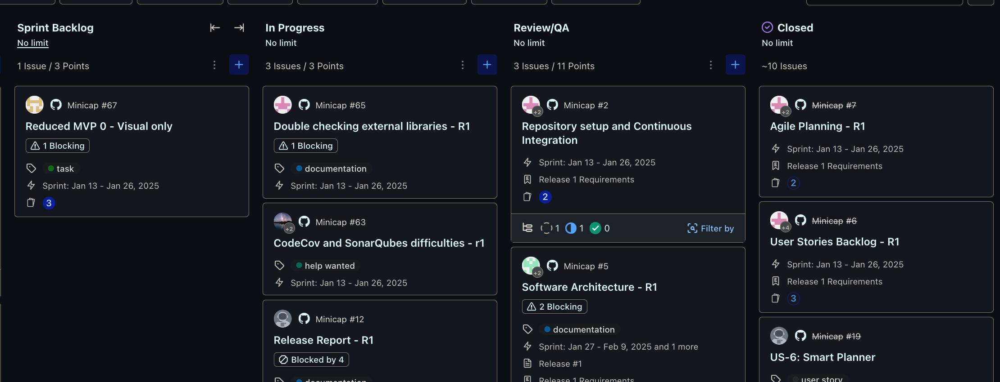

# Team Work Procedures (Updated - 2025-01-26)

## Introduction

For efficient application development with an 11-person team, we use overlapping roles across **Design** and **Development** phases within a 28-day release cycle (2 x 2-week sprints).

* **Sprint 1 (Weeks 1-2):** Focus on Design (first 3 days) and feature development (Feature 1).
* **Sprint 2 (Weeks 3-4):** Feature development (Feature 2), bug fixes, reporting.
* **Goal:** Deliver one feature *coded* per 2-week sprint, with a full release report and testing suite per 28-day release cycle.  Features may not be fully tested by sprint end, but all feature-related tasks must be coded.
* **Design Pattern:** MVVM.
* **Documentation:** All documentation will be pushed to GitHub. QA procedures are documented separately: [Testing Procedures](./testing-procedures.md)

## 28-Day Release Cycle Timeline

* **Days 1-3: Design Phase (Sprint 1 - Week 1)**
  * Diagrams (System Context, Component, ERD)
  * Operation Contracts
  * Wireframes
  * Sprint Plan & Backlog Refinement
* **Days 4-14: Code Phase - Sprint 1 (Weeks 1-2)**
  * Sprint Backlog Task Execution - Feature 1 Development (Coding)
  * Code Development & Unit Testing (ongoing)
  * Pull Requests & Code Reviews (ongoing)
  * **Day 14 (End of Sprint 1): Feature 1 Code Complete.** All tasks related to Feature 1 coding must be finished.
* **Days 15-27: Code Phase - Sprint 2 (Weeks 3-4)**
  * Sprint Backlog Task Execution - Feature 2 Development (Coding)
  * Code Development & Unit Testing (ongoing)
  * Pull Requests & Code Reviews (ongoing)
  * **Day 28 (End of Sprint 2 / Release Day): Feature 2 Code Complete.** All tasks related to Feature 2 coding must be finished.
* **Days 25-27: Report Phase (End of Sprint 2 - Week 4) - *Scrum Masters and QA Only***
  * Scrum Master Reports & Retrospectives
  * Release Documentation Finalization
  * **Important:** The Report Phase is *exclusively* for Scrum Masters and QA. All other team members (Frontend Developers, Backend Developers, Team Leads, System Designers, UI/UX Designers) continue coding on new tasks during this phase.

## Team Roles

Roles are assigned per release. Discuss role changes with Scrum Masters.

* **Scrum Master (3):** Sprint planning, project management, meeting documentation, user stories/tasks, sprint execution, *Report Phase activities*, *Panel member for bi-weekly meetings*.
* **Team Lead (4):** Subteam communication (to/from Scrum Masters), team progress updates, *Must attend bi-weekly meetings to present tasks and participate in Panel reviews*.
* **System Designer (3):** System diagrams, operation contracts, ERDs (completed before coding)
* **UI/UX Designer (2):** Wireframes (based on personas, usability, completed before development)
* **Frontend Developer (6-7):** UI implementation (wireframes, styling, UI library)
* **Backend Developer (2):** API development/maintenance,data model, data persistence
* **QA Team (2)**: Unit tests, system tests (TDD) and code quality reports

## General Procedures

Pipelines relevant for general devs

### **Working with Sprint Backlog (Zenhub):**

* Scrum Masters populate `Sprint Backlog`.
* Assign task to yourself, move to `In Progress`, create GitHub branch.
* **Pull Requests & Code Reviews:**
  * Anyone can open a Pull Request (PR) for completed tasks.
  * Move task to `Ready for Review/QA` in Zenhub when PR is opened.
  * *Formal code reviews are primarily conducted collaboratively by the Panel of Peers during bi-weekly meetings.*  However, *anyone* in the team is welcome and encouraged to add code reviews to any PR at any time to contribute their expertise and improve code quality.
* **Scrum Master - Project Manager Meetings:** Weekly updates and feedback.
* **Subteam Meetings:**  Team Lead scheduled as needed. Tasks sized for ~3 days for sprint momentum.

### **Bi-weekly Meetings (Panel Review & PR Management):**

* **Purpose:** Team Leads present tasks ready for Pull Requests (PRs) to the *Panel of Peers* (Team Leads and Scrum Masters) for collaborative review and merging.
* **Agenda:**
  * Team Leads present completed tasks and associated PRs.
  * Panel discusses each task/PR, focusing on code quality and alignment with sprint goals.
  * Panel members conduct code reviews *during the meeting* to ensure consistent standards and share knowledge.
  * Panel merges approved PRs or provides feedback and keeps PR open for revisions.
* **Panel Definition:** The *Panel of Peers* consists of Team Leads and Scrum Masters, fostering shared responsibility for code quality.
* **Attendance:** Open to all team members, but Team Leads *must* attend to present their team's tasks and participate in the peer review Panel. Anyone needing to present a task to the Panel should also attend.
* **Outcome:** Progress review, PR merging, issue resolution, and sprint alignment. Approximates sprint burndown management.
* **PR Closing:** PRs can only be merged and closed during these sessions by panelists.

## Design Phase Procedures

* **User Stories & Tasks (Scrum Masters):** Write user stories, break into tasks, planning poker, dependency trees, sprint backlog population. Goal: Design tasks done in first 3 days of Sprint 1.
* **Design Outputs (System/UI/UX Designers):** Diagrams, operation contracts, ERDs, wireframes. Inputs for development; must be fast-tracked in Sprint 1.

## Development Phase Procedures

* **Task Assignment & Dependencies (Scrum Masters):** Ensure independent tasks in backlog for parallel development across Sprints 1 & 2 (based on design phase dependencies).
* **Pair Programming (Recommended):** Tasks sized for pairs (ideally with a Team Lead or Scrum Master in each pair). Team leads must present at the biweekly, so if there's no team lead in the sub unit, you must come to the biweekly.
* **Unit Testing - "Implement then Test, Immediately":** After implementing, *immediately* write unit tests (Jest). Create "Write Unit Tests" sub-task in Zenhub for tracking.

Got it.  Here's the updated section with the changes you requested:

## Scrum Master Guidelines

* **Design Phase Task Size:** Solvable by one person to minimize dependencies and ensure fast design phase in Sprint 1.
* **Development Phase Task Size:** For teams of two, completable within Sprint 1 & early Sprint 2.
* **Unit Testing Sub-tasks:** Add "Write Unit Tests" sub-tasks to track unit testing. Once PR is done
* **Scrum Masters will ensure task dependencies and parent/child issue relationships are properly defined and managed.**

**Task Naming Conventions:**

To ensure clarity and consistency across all tasks, use the following naming conventions incorporating your task types and numbering system `{featureNumber}.{userStory}.{taskNumber}`:

* **User Story (US):** `[US] {featureNumber}.{userStory} - {Concise User Story Title or Description}`
* **Testing (Test):** `[Test] {featureNumber}.{userStory}.{taskNumber} - {Specific Test Type} - {Task Name}`
* **Concrete Programming Task (Task):** `[Task] {featureNumber}.{userStory}.{taskNumber} - {Action Verb} - {Component or Feature}`
* **Bug (Bug):** `[Bug] {BugNumber} - {Concise Bug Description}`
* **Documentation (Doc):** `[Doc] - {Documentation Type} - {What is being documented}`

## Changelog

* **2025-01-25 Initial Doc:** After Sprint 1 review. Issues: Tasks were too big, weekly meetings insufficient to catch mistakes early. **Changes:** Tasks sized for 1-2 people, 3-day target; bi-weekly PR closing for better sprint visibility.
