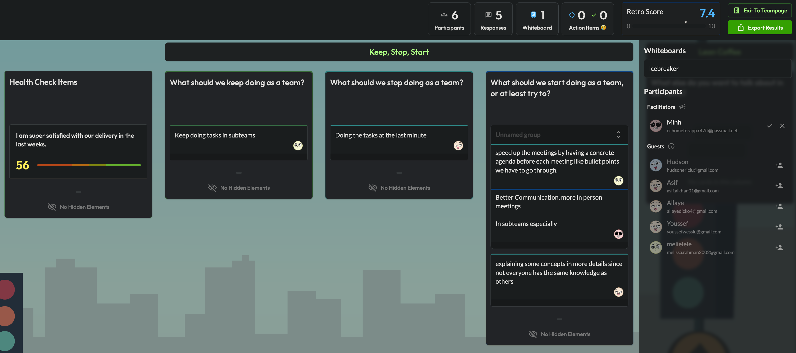

# **Meeting:** Bi-Weekly Team Review

**Date:** 2025-01-27
**Time:**  11h000 - 12h20
**Purpose:** Review panel's regular bi-weekly meeting
**Attendees:** Minh, Youssef, Allaye, Melissa, Asif
**Absent:** [List any individuals who were expected but not present]

## Agenda Items

### **1. Issues Changelog**

#### **a) Closed Issues**

| Issue # | Title                       | Resolution/Summary                                            |
| :------ | :-------------------------- | :------------------------------------------------------------ |
| #73     | Sprint Review S1            | Review completed. Key takeaways documented.                   |
| #69     | Write Personas Document     | Document drafted and shared for review.                       |
| #67     | Reduced MVP 0 - Visual only | Accepted Though Needs Refactoring                             |
| #5      | Software Architecture - R1  | Initial architecture review completed. Feedback incorporated. |

#### **b) Opened Issues**

| Issue # | Title                                 | Description/Reason                                                           |
| :------ | :------------------------------------ | :--------------------------------------------------------------------------- |
| #81     | Doc - Create Issues for accessibility | Need to identify and document accessibility requirements as separate issues. |
| #79     | MVP 0 Refactoring to use Gluestack    | To have reusable components                                                  |

#### **c) Issues Rejected:**

| Issue # | Title         | Status                        | Next Steps                   |
| :------ | :------------ | :---------------------------- | :--------------------------- |
| [#]     | [Issue Title] | [Current status of the issue] | [What needs to be done next] |

### **2. Sprint Retrospective (Sprint 1)**

   

### **3. Presented Work Procedures**

   **Document:** [Work Procedures Wiki](https://github.com/AsifAliKhan2001/Minicap/wiki/Work-Procedures)

   **Discussion:**

* Document accepted with no changes.
* Team Lead Questions Clarified

### **4. Action Items/To-Do from this meeting**

* Team Leaders to self assign on issues and recruit a 2nd developer
