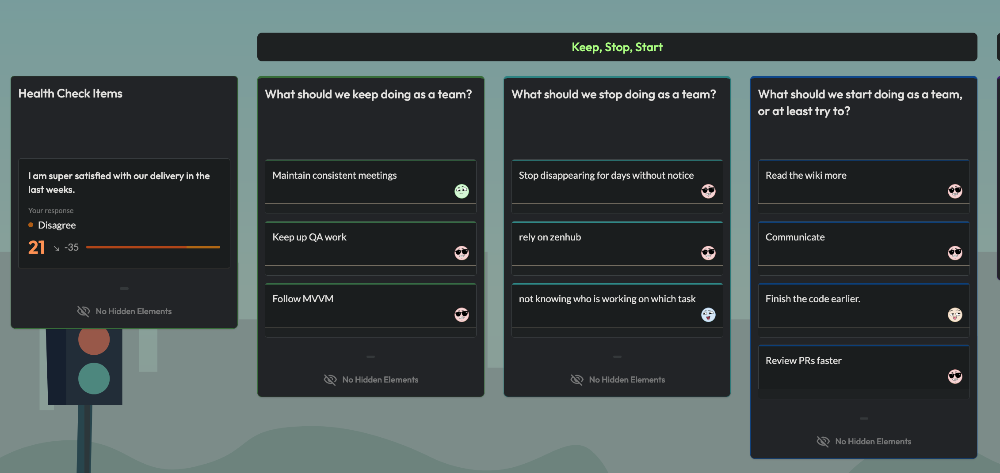

# **Meeting:** Sprint Retrospective

**Date:** 2025-02-12
**Time:** 11h00 - 12h00
**Purpose:** Sprint Retrospective Review
**Attendees:** Minh, Melissa, Edward, Hudson, Azal
**Absent:** 

## Agenda Items

### **1. Sprint Review**

### **2. Discussion Points**

#### **What Went Well**
- Documentation improvements
- MVVM setup

#### **What Could Be Improved**
- Meeting attendance
- Task distribution (Zanhub was down)
- Timeline management

#### **Action Items**
- Implement stricter meeting attendance policy
- Review and adjust sprint workload distribution
- Set up additional check-ins for timeline tracking

### **3. Next Sprint Planning**

#### **Priority Items**
- Complete remaining accessibility issues
- Begin work on MVP1 features
- Update technical documentation

### **4. Action Items/To-Do**
- Team leads to review sprint assignments
- Prepare for Presentation